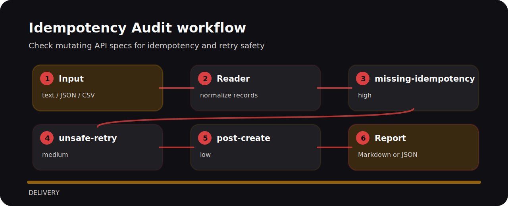

# Idempotency Audit


## Where it helps

This repository turns a tiny plain text into reviewable signals for idempotency review.

| Detail | Value |
| --- | --- |
| Area | delivery |
| Entry | `idempotency-audit` |
| Input | plain text |
| Output | terminal findings, optional JSON |

## Policy flow



| Signal | Level | What it flags | Fix direction |
| --- | --- | --- | --- |
| `missing-idempotency` | high | mutating endpoint lacks idempotency | Require an idempotency key or documented dedupe behavior. |
| `unsafe-retry` | medium | retries are allowed without safety language | Define retry semantics and duplicate handling. |
| `post-create` | low | mutating POST endpoint detected | Check whether the endpoint needs idempotency guarantees. |

## One-pass run

```bash
git clone https://github.com/mertefekurt/idempotency-audit.git
cd idempotency-audit
python -m pip install -e ".[dev]"
idempotency-audit examples/sample.txt
```
